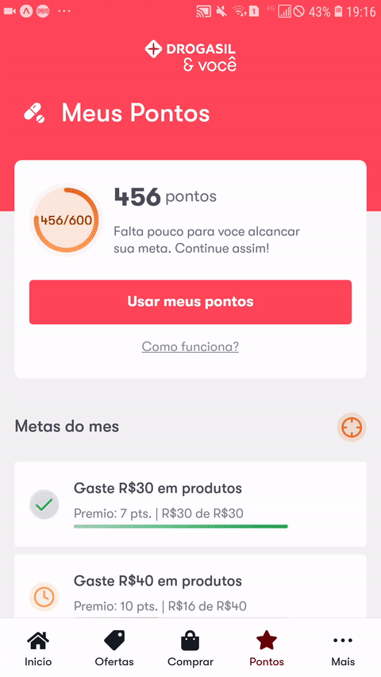
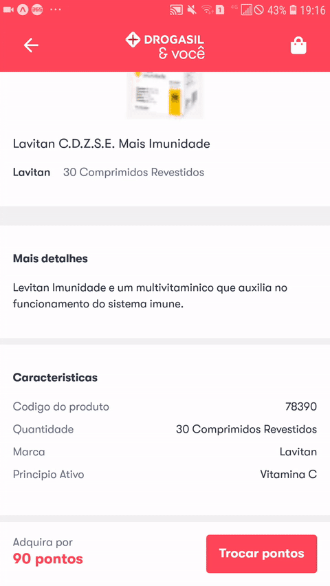

<h1 align="center">
  Drogasil Pontos
</h1>
<p align="center"><span>Front-end de protótipo utilizando Expo, React Native e Styled-Components, com TypeScript</span></p>
<p align="center">(Projeto realizado para fins de estudo)</p>
<p align="center">
  <br />
  <a href="#">
    
  </a>
  
  <a href="#">
    
  </a>
  
  <a href="#">
    
  </a>
  
  <a href="https://github.com/rodolfoviolla/dg-points/blob/master/LICENSE">
    
  </a>
</p>
<p>
  Front-end construído à partir de protótipo de nova funcionalidade para o aplicativo da Drogasil. Este projeto é uma parceria com o designer, desenvolvedor e amigo Felipe Marcon, que recebeu o prêmio de terceiro lugar no uiBoost com o design desta aplicação.
</p>

### Design por
<p>
  <a href="#">
    
    <br>
    <sub><b>Felipe Marcon</b></sub>
    <br>
    <a href="https://www.behance.net/felipeemarcon">
      Behance
    </a>
    <br>
    <a href="https://dribbble.com/felipee_marcon">
      Dribble
    </a>
  </a>
</p>

<p align="center">
  &nbsp
  &nbsp
  
</p>

### Pré-requisitos

Você vai precisar ter instalado em sua máquina as seguintes ferramentas:
[Git](https://git-scm.com), [Yarn](https://classic.yarnpkg.com/pt-BR/) e [Expo](https://expo.io/)
É bom ter um editor para trabalhar com o código como [VSCode](https://code.visualstudio.com/)

### Rodar a aplicação localmente

```bash
# Clone o repositório na sua máquina
$ git clone <https://github.com/rodolfoviolla/dg-points>

# Acesse a pasta do projeto no teminal/cmd
$ cd dg-points

# Instale as dependências
$ yarn

# Inicie o Expo no browser
$ yarn start

# Faça o scaneamento do QRCode através do aplicativo do Expo e aguarde o projeto iniciar
```

### Tecnologias

As seguintes ferramentas foram usadas na construção do projeto:

- [Expo](https://expo.io/)
- [React Native](https://reactnative.dev/)
- [TypeScript](https://www.typescriptlang.org/)

### Autor
---

<p>
  <a href="#">
    
    <br />
    <sub><b>Rodolfo Della Violla</b></sub>
  </a>

  <p>
    <a href="https://www.linkedin.com/in/rodolfoviolla/">
      
    </a>
    <a href="https://twitter.com/RodolfoViolla">
      
    </a>
    <a href="mailto:rodolfo.violla@gmail.com">
      
    </a>
  </p>
</p>

## Licença

Este projeto esta sobe a licença [MIT](./LICENSE.md).
